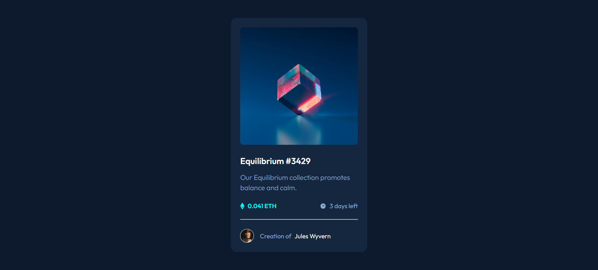

# 🪙 NFT Component
Esta es una solución al [desafío NFT preview card component en Frontend Mentor](https://www.frontendmentor.io/challenges/nft-preview-card-component-SbdUL_w0U). Los desafíos de Frontend Mentor ayudan a mejorar tus habilidades de programación creando proyectos realistas.

## 🔎 Descripción general
He creado este simple componente con React de forma que sea reutilizable, es decir, introduciendo los parámetros necesarios puedes crear el mismo componente con el NFT que desees. Esto es súper útil para evitar la repetición de código innecesario además de ser mucho más legible.

Diseño responsive para resolución mobile(375px), tablet(768px) y desktop(1440px)

### 📷 Captura de pantalla

### 🔗 Links
- [URL de la solucion](https://www.frontendmentor.io/solutions/solution-nft-component--60d7_OE_a)
- [URL del sitio en vivo](https://braismarquez2025.github.io/nft-preview-card-component/)

## 🚀 Mi proceso

### 🔧 Llevado a cabo con
- React + Vite
- Sass

### ✌️ Autor 
- 💼 GitHub - https://github.com/braismarquez2025
- ✉️ Gmail - braismarquez2003@gmail.com
- 👤 Usuario de Frontend - [@braismarquez2025](https://www.frontendmentor.io/profile/braismarquez2025)
- 🔗 LinkedIn - [Brais Márquez](https://www.linkedin.com/in/brais-m%C3%A1rquez-b133b7365/)